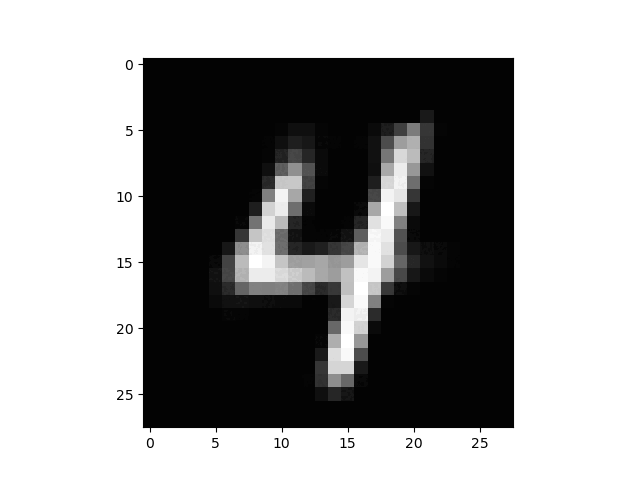

# 🧠 Autoencoder & Latent Space Exploration

This repository explores **autoencoders** and their **latent space representations** through interactive visualization and practical experiments.

## 🚀 Overview

Autoencoders are unsupervised neural networks that learn efficient data codings by compressing inputs into a **latent space** and then reconstructing them. This project demonstrates how the learned embeddings can be manipulated and visualized to gain insights into the structure of the data.

Currently, the repository includes:
- A **simple autoencoder architecture** trained on image data.
- A **latent space traversal script** that linearly interpolates between two latent embeddings.
- An animated **GIF** showing the smooth transition between two embeddings in the latent space — a visual proof of the model's encoding-decoding consistency.

## 🖼️ Latent Space Traversal

The interpolation process takes two embeddings `A` and `B` and generates intermediate latent vectors.

Here from 4 -> 6 -> 4 etc..

